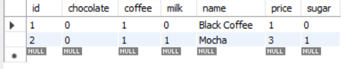
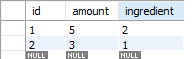
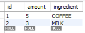
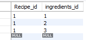
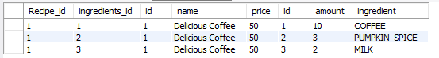

# Part 1: Database and Persistence Implementation

We'll start our backend implementation and testing by reviewing some of the fundamentals of Relational Databases and, in particular, how they work with Hibernate and how you can actually use them.  For a refresher on what Hibernate is, and why we use it, see the background material under the [Hibernate](https://pages.github.ncsu.edu/engr-csc326-staff/326-course-page/onboarding/hibernate) section of the OBP.  Today, however, we'll cover in more detail how databases actually _store_ data and how we can build up increasingly complex data structures (just like you've already seen with composing objects together in Java).

**Make sure your local MySQL server is running!**

## Background

We will be talking about _relational_ databases, which you most commonly interact with by writing _SQL queries_.  There are non-relational databases, which offer some advantages for some use cases, but they are beyond the scope of what we're talking about today.  

Fundamentally, relational databases store data in _tables_, which are, at a high-level view, very much like tables that you're familiar with from spreadsheet software such as Excel.  That is, each table has a set of _`columns`_, which have a name and a type, and _`rows`_, which have concrete values corresponding to the actual entities (or records) that get saved into the table.  As explained in the linked background above, Hibernate automatically takes care of creating these tables based on our Java classes and then creating rows in the table from actual objects that we are working with.

Consequently, if we define a class such as:
```java

public class Recipe {
   private int id;
   private String name;
   private int price;
   private int coffee;
   private int milk;
   private int chocolate;
   private int sugar;
}

```

then Hibernate will create a table that looks something like this:

| id (_int_) | name (_varchar_) | price (_int_) | coffee (_int_) | milk (_int_) | chocolate (_int_) | sugar (_int_) |
| ------------- |-------------| -----|-------|---------|----------|---------------|
|actual|values|would|go|here|and|here|

(note that the actual types would not be shown when looking at the table like this, but they are included here to help clarify that *yes, each column has a type*)

Further imagine that we have two recipes, as shown below, that we wanted to save into the table:
* `Recipe(id=1,name=Black Coffee,price=1,coffee=1,milk=0,chocolate=0,sugar=0)`
* `Recipe(id=2,name=Mocha,price=3,coffee=1,milk=1,chocolate=0,sugar=1)`

Hibernate would then create records in the table like the following:

| id (_int_) | name (_varchar_) | price (_int_) | coffee (_int_) | milk (_int_) | chocolate (_int_) | sugar (_int_) |
| ------------- |-------------| -----|-------|---------|-----|-----|
|1|Black Coffee|1|1|0|0|0|
|2|Mocha|3|1|1|0|1|


We can write Java code to help us generate database contents.  This is helpful for testing because we can set up a starting state for the database.  The code below creates a class `GenerateRecipesSimple` that can be used to create two recipes for your database.  Create a class for the `GenerateRecipesSimple` in your `src/test/java/` source folder.  You can create a new package for data generation classes.


```java

package edu.ncsu.csc.CoffeeMaker;

import org.junit.Assert;
import org.junit.Test;
import org.junit.runner.RunWith;
import org.springframework.beans.factory.annotation.Autowired;
import org.springframework.boot.autoconfigure.EnableAutoConfiguration;
import org.springframework.boot.test.context.SpringBootTest;
import org.springframework.test.context.junit4.SpringRunner;

import edu.ncsu.csc.CoffeeMaker.models.Recipe;
import edu.ncsu.csc.CoffeeMaker.services.RecipeService;

@RunWith ( SpringRunner.class )
@EnableAutoConfiguration
@SpringBootTest ( classes = TestConfig.class )
public class GenerateRecipesSimple {

    @Autowired
    private RecipeService recipeService;

    @Test
    public void testCreateRecipes () {

        recipeService.deleteAll();

        final Recipe r1 = new Recipe();
        r1.setChocolate( 0 );
        r1.setCoffee( 1 );
        r1.setMilk( 0 );
        r1.setName( "Black Coffee" );
        r1.setPrice( 1 );
        r1.setSugar( 0 );

        final Recipe r2 = new Recipe();
        r2.setChocolate( 0 );
        r2.setCoffee( 1 );
        r2.setMilk( 1 );
        r2.setName( "Mocha" );
        r2.setPrice( 3 );
        r2.setSugar( 1 );

        recipeService.save( r1 );
        recipeService.save( r2 );

        Assert.assertEquals( "Creating two recipes should results in two recipes in the database", 2,
                recipeService.count() );

    }

}

```
 

Run the `GenerateRecipesSimple` test (right-click, Run As -> JUnit Test) to populate the database with the two recipes from above.  Then, using MySQL Workbench, or a similar tool, check that the recipes were created properly.  Note that the ID of the recipe may be different, as it gets randomly generated by the database, but everything else should be the same.  With MySQL Workbench, connect to the database, then click Schemas on the left side, expand `coffeemaker`, expand `Tables`, and right-click on `recipe` and select `Select Rows - Limit 1000`.  You should be greeted with a view similar to below:



You can also use the SQL statement of 

```
SELECT * FROM recipe;
```

How do we handle scenarios where we want to create more complicated Recipes, such as a Pumpkin Spice Latte?  Our current approach would require us to modify our database schema, which is often difficult to do in-place (that is, without destroying the data that we already have stored).  Thus, we'd ideally like to abstract out the ingredients associated with a `Recipe` into an `Ingredient` class, and then allow a `Recipe` to have multiple, arbitrary `Ingredient`s that are associated with it.  We'll see below how to make this happen.

## Composing Entities Together

So, what we've seen so far is that it's possible to create Java objects that get automatically converted into rows in a database table when we call the `save()` method.  But, so far, all that we have created is a very simple class -- a single Java class whose fields are all primitives or other built-in types (e.g., a String).  This is not particularly representative of how most real-world entities actually look.  So, next, we'll learn how to compose together objects out of more complicated types and have them persist in the database.

In object-oriented languages like Java, one of the fundamental relationships between classes is _composition_ -- one object has a field that is an instance of another object. Java maintains a _reference_ to the object in memory.  Dereferencing (i.e., the "." notation) the field let's you work with the field's (public) state and behaviors.  But, how does this work for database entities?  The answer is _`primary keys`_ and _`foreign keys`_.

### Primary Keys
Most database entities that you will work with will have a _primary key_.  A primary key is a column (or set of columns) within a table that is _guaranteed_ to be unique.  In the `Recipes` table above, the `id` column is the primary key for the entity; there can _never_ be two recipes that have the same id.  This is similar to Unity IDs -- each ID is guaranteed to be unique to one and only one person.  This is useful because although there might be multiple types of Mocha recipe, we now have a guaranteed way to refer to _our_ Mocha recipe from above.

### Foreign Keys
Foreign keys work very similarly to primary keys -- they are a way to uniquely identify a single row within a table.  However, instead of uniquely identifying a record within the _current_ table, a foreign key uniquely identifies a record within a _different_ table.  How does it do this?  A foreign key in Table A will contain the same value that is stored in the _primary key_ for a row in Table B -- thus giving us a direct reference to another object.  Thus, this basically gives us a way to uniquely reference an object that exists in _another_ table that we care about.  We'll see in a moment how to define these in Hibernate, and what it then looks like when actual database tables get created from it.

### Joining Entities in Hibernate

How does all of this actually work in Hibernate?  Hibernate is a very powerful framework, that gives you the ability to represent nearly anything that a relational database is capable of.  One powerful way to work with multiple tables is through the idea of a _join_, which brings information in tables together.  Our composition relationship is supported through joins of tables in a database.    

We'll focus on the following annotations that support joining entities in a database and tying them to the objects in our application:

* `@OneToOne`
* `@OneToMany`

`OneToOne` is exactly like the one-to-one relationship you learned with UML in CSC 216 -- it establishes that for each entity of Object A, there is one associated entity of Object B.  For an example of this, we'll look ahead briefly to iTrust2, a medical records application we'll use for our Team Project.  In iTrust2, patients can request a medical visit with a health care provider (HCP), which creates an `AppointmentRequest`. Once the patient attends the appointment, an `OfficeVisit` is created.  We expect a one-to-one mapping between these two because each office visit should be the result of one and only one requested appointment -- and likewise, a single appointment request should turn into only one office visit (follow-up visits would also have their own corresponding appointments).  

`OneToMany` lets us map between the recipe we've created and the ingredients that go into it.  This is a relationship that handles _multiplicity_; each individual recipe can have one ingredient, or it can have multiple ingredients.  `@OneToMany` lets have a collection of an object as the field of one of our persistent classes.

### Design Overview
Our goal is to decouple the recipe from the ingredients that are associated with it.  Instead of a recipe that can have 4 ingredients.   In our current Recipe implementation, we always  have 4 ingredients and we are storing 0s for any of the ingredients that aren't part of the recipe.  That is wasted space.  Instead, we want to create recipes that can have only the ingredients appropriate for the recipe.

To explore the functionality of Hibernate, we're going to explore a partial solution of the arbitrary ingredients requirements. The work that you'll do in this workshop is a start towards meeting the new requirements, but it is _not sufficient_ because the enumerated types do not support dynamic ingredient types when adding or editing recipes.

For this workshop, we'd like to create an `IngredientType` enumeration, which represents a specific type of ingredient that you'd put into a Coffee recipe (such as Coffee, Milk, Sugar, or Pumpkin Spice).  Then, we want an `Ingredient` class that represents _a specific amount of one of the previous ingredients_ (such as, {Coffee, 10} or {Pumpkin Spice, 5}).  

Then we want our `Recipe` class to keep track of an arbitrary number of these `Ingredient` instances, so that we can build up any type of Coffee recipe without changing our database schema.

In short, we want a collection (in Java nomenclature, a List, or Set, or similar) of some sort of element (`Ingredient`s) that gets attached to our `Recipe`.  This is what the `OneToMany` join lets us do -- we can specify, in the `Recipe` class, that we have a collection of some other type (in our case, `Ingredient`) that Hibernate then handles saving it to the database.


## Adding arbitrary Ingredients to CoffeeMaker

In the previous section, we laid out an overview of a design for how we would like to structure the new-and-improved version of CoffeeMaker, and discussed joins we could use to solve the problem.  Now, let's start implementing it, a piece at a time.


### Creating the `IngredientType` enum

The first task is to create a representation of a specific type of `Ingredient` that can get added to a recipe.  Enumerations don't get saved directly into the database, so create a new package called `edu.ncsu.csc.CoffeeMaker.models.enums`, then create a new `Enum` inside this package.  This one is called `IngredientType`, please call yours the same thing to enable some of the other example code to work.  Once you've created the enum, add in several values representing things you'd enjoy in a coffee.  Please make sure it at least contains "COFFEE", "MILK" and "PUMPKIN_SPICE" as we are going to make delicious coffee! 

### Creating the Ingredient class
The next step is to create an `Ingredient` class -- something we can actually store in the database that represents a specific ingredient (as given in our enumeration), with a specific quantity as needed by recipes.  Start off by creating an `Ingredient` class under the `models` package (note, _not_ the `models.enums` package -- alongside the existing `Recipe` class).  Here are some key things to consider when you make a new persistent class:

* Extend the `DomainObject` class.  `DomainObject` is the root of all persistent classes in CoffeeMaker, and the Service classes that handle saving objects to the DB expect your class to be a subclass of `DomainObject.
* Add the `@Entity` annotation up above your class definition.  This signifies that the class is something that will get persisted to the database.


### Clean Up `Recipe`
Now that we're creating a separate way of tracking ingredients, there's a lot of stuff within the `Recipe` class that we don't need any more.  Delete the `coffee`, `sugar`, `milk`, and `chocolate` fields, and their associated annotations, getters, and setters.  You can also remove the `updateRecipe` method and chop out most of the constructor to remove the compilation errors.  

This will break the `GenerateRecipesSimple` class.  That's fine, you can ignore it or delete it.  It's purpose has been served now.

### Defining the `Ingredient` class

`Ingredient` should define three fields: 

* An `id` field, which serves as the primary key for the database to reference things so that we can keep track of them and reference them from other tables later.  Make this a `Long`.
* An `ingredient` field, which uses our `IngredientType` enumeration.
* An `amount` field.  An `Integer` is probably most reasonable here.

Next, use Eclipse to generate a constructor that takes an `IngredientType` and an amount, getters and setters, and a toString method.  All of these are available under the `Source` option if you right-click anywhere in the class. (e.g., Right-click > Source > Generate *).  _You'll also want to create a constructor that takes no arguments for Hibernate to use when loading objects from the database._


### Defining the Repository and Service

CoffeeMaker (and later, iTrust2) are built using the Spring Boot framework, a popular framework for creating enterprise-class Java applications.  Spring will handle most of the hard work of saving our objects to the database (and, naturally, retrieving them later on), but we need to do a bit more work to tell it how to do so.

Under the `repositories` package, go create a new `interface` and call it `IngredientRepository`.  The body of this interface will be empty (ie, there will be no methods inside of it) but make sure to extend from `JpaRepository`.  When you're done, you should have something like:


```java

package edu.ncsu.csc.CoffeeMaker.repositories;

import org.springframework.data.jpa.repository.JpaRepository;

import edu.ncsu.csc.CoffeeMaker.models.Ingredient;

public interface IngredientRepository extends JpaRepository <Ingredient, Long> {

}

```

You might reasonably be wondering, "What good does it possibly do to create an empty interface like this?".  Well, what this does is tell Spring that we are interested in storing a collection of `Ingredient` objects, each of which is identified by a `Long` as the primary key.  Note that, in a general sense, the ID doesn't need to be a `Long`, but for consistency with the `Ingredient` we defined above, it needs to be one here.  For more information, you can check out the [Spring docs](https://docs.spring.io/spring-data/commons/docs/current/api/org/springframework/data/repository/Repository.html) which explain a bit more on how this works.


Next, we'll write the second class that lets Spring work its magic.  Under the `services` package, create a new class `IngredientService` and make it extend from `Service`.  Next, before you do anything else, add the annotations `@Component` and `@Transactional` to the class.  What do these do?  `@Component` defines that this is a "component" class that should be considered a candidate for autowiring into our other classes (basically, when we use an instance of our `Service` in other classes, Spring will automatically go create the instance without us needing to do anything else.  This will automatically provide usable instances of the Service to our API controllers (the next section of this Workshop) and our tests).  `@Transactional` tells Spring to use this class in a way that supports transaction rollback, which means that if something goes wrong in the middle of updating the database, it won't be left in an inconsistent partial state.  Also, more interestingly, it enables _transaction rollback_ for our tests, which ensure that the database won't be filled with junk after multiple tests are run.

Your `IngredientService` class will need one field, and one method: an `@Autowired` instance of the `IngredientRepository`, and a `getRepository()` method that returns this instance.  If you're not quite sure what this would look like, you can check out the other two `Service` classes in CoffeeMaker for some hints.


Now we have a Java class defined, let's try storing some data to the database.  Let's try using it to see what happens.  Create a class in your data generation package called `GenerateIngredients` and copy in the following code.  Make sure everything compiles and run the class.

```java

package edu.ncsu.csc.CoffeeMaker;

import org.junit.Assert;
import org.junit.Test;
import org.junit.runner.RunWith;
import org.springframework.beans.factory.annotation.Autowired;
import org.springframework.boot.autoconfigure.EnableAutoConfiguration;
import org.springframework.boot.test.context.SpringBootTest;
import org.springframework.test.context.junit4.SpringRunner;

import javax.transaction.Transactional;

import edu.ncsu.csc.CoffeeMaker.models.Recipe;
import edu.ncsu.csc.CoffeeMaker.models.Ingredient;
import edu.ncsu.csc.CoffeeMaker.models.enums.IngredientType;
import edu.ncsu.csc.CoffeeMaker.services.IngredientService;

@RunWith ( SpringRunner.class )
@EnableAutoConfiguration
@SpringBootTest ( classes = TestConfig.class )
public class GenerateIngredients {

    @Autowired
    private IngredientService ingredientService;

    @Test
    @Transactional
    public void testCreateIngredients() {
        ingredientService.deleteAll();
	
        final Ingredient i1 = new Ingredient( IngredientType.COFFEE, 5 );

        ingredientService.save( i1 );

        final Ingredient i2 = new Ingredient( IngredientType.MILK, 3 );

        ingredientService.save( i2 );
		
        Assert.assertEquals( 2, ingredientService.count() );

        
    }
}
```

### Telling Hibernate What To Do

Uh-oh.  If you ran the class as mentioned above, you probably got an error message.  When it runs, you should see the following:

```
~snip~
Caused by: org.hibernate.AnnotationException: No identifier specified for entity: edu.ncsu.csc.CoffeeMaker.models.Ingredient
	at org.hibernate.cfg.InheritanceState.determineDefaultAccessType(InheritanceState.java:266) ~[hibernate-core-5.4.25.Final.jar:5.4.25.Final]
	at org.hibernate.cfg.InheritanceState.getElementsToProcess(InheritanceState.java:211) ~[hibernate-core-5.4.25.Final.jar:5.4.25.Final]
	at org.hibernate.cfg.AnnotationBinder.bindClass(AnnotationBinder.java:781) ~[hibernate-core-5.4.25.Final.jar:5.4.25.Final]
	at org.hibernate.boot.model.source.internal.annotations.AnnotationMetadataSourceProcessorImpl.processEntityHierarchies(AnnotationMetadataSourceProcessorImpl.java:248) ~[hibernate-core-5.4.25.Final.jar:5.4.25.Final]
	at org.hibernate.boot.model.process.spi.MetadataBuildingProcess$1.processEntityHierarchies(MetadataBuildingProcess.java:239) ~[hibernate-core-5.4.25.Final.jar:5.4.25.Final]
	at org.hibernate.boot.model.process.spi.MetadataBuildingProcess.complete(MetadataBuildingProcess.java:282) ~[hibernate-core-5.4.25.Final.jar:5.4.25.Final]
	at org.hibernate.jpa.boot.internal.EntityManagerFactoryBuilderImpl.metadata(EntityManagerFactoryBuilderImpl.java:1224) ~[hibernate-core-5.4.25.Final.jar:5.4.25.Final]
	at org.hibernate.jpa.boot.internal.EntityManagerFactoryBuilderImpl.build(EntityManagerFactoryBuilderImpl.java:1255) ~[hibernate-core-5.4.25.Final.jar:5.4.25.Final]
	at org.springframework.orm.jpa.vendor.SpringHibernateJpaPersistenceProvider.createContainerEntityManagerFactory(SpringHibernateJpaPersistenceProvider.java:58) ~[spring-orm-5.2.12.RELEASE.jar:5.2.12.RELEASE]
	at org.springframework.orm.jpa.LocalContainerEntityManagerFactoryBean.createNativeEntityManagerFactory(LocalContainerEntityManagerFactoryBean.java:365) ~[spring-orm-5.2.12.RELEASE.jar:5.2.12.RELEASE]
	at org.springframework.orm.jpa.AbstractEntityManagerFactoryBean.buildNativeEntityManagerFactory(AbstractEntityManagerFactoryBean.java:391) ~[spring-orm-5.2.12.RELEASE.jar:5.2.12.RELEASE]
	at org.springframework.orm.jpa.AbstractEntityManagerFactoryBean.afterPropertiesSet(AbstractEntityManagerFactoryBean.java:378) ~[spring-orm-5.2.12.RELEASE.jar:5.2.12.RELEASE]
	at org.springframework.orm.jpa.LocalContainerEntityManagerFactoryBean.afterPropertiesSet(LocalContainerEntityManagerFactoryBean.java:341) ~[spring-orm-5.2.12.RELEASE.jar:5.2.12.RELEASE]
	at org.springframework.beans.factory.support.AbstractAutowireCapableBeanFactory.invokeInitMethods(AbstractAutowireCapableBeanFactory.java:1853) ~[spring-beans-5.2.12.RELEASE.jar:5.2.12.RELEASE]
	at org.springframework.beans.factory.support.AbstractAutowireCapableBeanFactory.initializeBean(AbstractAutowireCapableBeanFactory.java:1790) ~[spring-beans-5.2.12.RELEASE.jar:5.2.12.RELEASE]
	... 62 common frames omitted
```
	
What happened here?	Hibernate is telling us that there is no id ("identifier") that is associated with our `Ingredient` class.  But, didn't we create an `id` field?  Yes, we did, but....we never actually told Hibernate that this _is_ an id field.  We have to define the fields that make up the id or primary key explicitly in our persistence classes.

Open up the `Ingredient` class again, and add the following above the id field you created:

```
@Id
@GeneratedValue
```

What does this do?  Well, not only do we specify that yes, in fact, this field called `id` is actually an ID, we also tell Hibernate that we'll have the database generate this automatically by incrementing a numeric value.  Technically, we don't _have_ to do it like this, but it's pretty common practice to let the DB generate its own IDs.  This saves us the trouble and it can be a bit faster than generating our own ids.

Now, go run the `GenerateIngredients` class again.  This time, it should run without any error.  Before we call the `Ingredient` class done, however, let's go look at the database to make sure that it saved what we would expect. First, refresh the database view to ensure we have the most up-to-date view (Right-click on Tables -> Refresh All). Now retrieve all Ingredients, as we did above for recipes.  Much to your surprise, you'll probably see an empty database table.  Why is this?  Well, the `@Transactional` annotation on our test method basically tells the test to clean up after itself -- it will run, and then roll back the transaction (effectively reverting the database to the position it was in before the test).  This is, in general, _excellent_, because it means that the test doesn't leave a mess of the database.  In our case, however, we want to see what's there.  Comment out the annotation, rerun, and you should see the following:



Well, that's good.  Our ingredients are now being saved to the database.  Congratulations, you've now defined your first persistence class and turned Java objects into database tables!  Go un-comment the `@Transactional` annotation now

There's one small thing that we'd like to fix before we move on, however: the values being stored under the `ingredient` column.  What are these numbers?  This doesn't make sense!  We didn't define our `ingredient` field as ints, so why do we get this here?  The short answer is that Java's enums all have both a String value -- the friendly name that you give them -- and an integer value -- that represents their ordinal position out of the values you've defined.  By default, Hibernate saves the integer value to the database. It's helpful to see the string value when working with the database so you can then look at the data that's stored in the database and it actually means something.  To fix this, add the following annotation above the `ingredient` field:

```
@Enumerated ( EnumType.STRING )
```


This tells Hibernate to save the String value of the enumeration to the database instead of just an int value.  Save your file, re-run the `GenerateIngredients` class, and then check the database again.  If you get an exception running the test class, drop the database and rerun -- this tells Hibernate to change how the data gets persisted, so it may need to rebuild the database table.  Now you should see the following:



Much better!  We know what these are now.

If you're not getting the right output here, ask a member of the teaching staff for help.  

### Telling Recipe about Ingredients

So far we've created an enumeration that contains various ingredient types, and created an `Ingredient` class that represents a certain amount of an ingredient.  But, what we don't have -- yet -- is the `Recipe`  _using_ these new `Ingredient`s.  

In the `Recipe` class, create a field of type `List<Ingredient>` and call it `ingredients` or similar.  Then, modify the Recipe constructor to initialize this list to an empty list (ArrayList or LinkedList is OK).  If we don't create an empty list, we'll get NPEs!  Also, define an `addIngredient` method that will take in a single `Ingredient` to add to this list, a `getIngredients` method that returns the entire list, and modify the `toString` method to print out all the ingredients.  We'll want these for testing in a moment.

Let's try using the updated `Recipe` class to see what happens.  Create a class in your data generation package called `GenerateRecipeWithIngredients` and copy in the following code.  Make sure everything compiles and run the class.

```java

package edu.ncsu.csc.CoffeeMaker;

import org.junit.Before;
import org.junit.Test;
import org.junit.runner.RunWith;
import org.springframework.beans.factory.annotation.Autowired;
import org.springframework.boot.autoconfigure.EnableAutoConfiguration;
import org.springframework.boot.test.context.SpringBootTest;
import org.springframework.test.context.junit4.SpringRunner;

import edu.ncsu.csc.CoffeeMaker.models.DomainObject;
import edu.ncsu.csc.CoffeeMaker.models.Ingredient;
import edu.ncsu.csc.CoffeeMaker.models.Recipe;
import edu.ncsu.csc.CoffeeMaker.models.enums.IngredientType;
import edu.ncsu.csc.CoffeeMaker.services.RecipeService;

@RunWith( SpringRunner.class )
@EnableAutoConfiguration
@SpringBootTest( classes = TestConfig.class )
public class GenerateRecipeWithIngredients {
	
	
	@Autowired
	private RecipeService recipeService;
	
	@Before
	public void setup () {
		recipeService.deleteAll();
	}
	
	
	@Test
	public void createRecipe () {
        final Recipe r1 = new Recipe();
        r1.setName( "Delicious Coffee" );

        r1.setPrice( 50 );

        r1.addIngredient( new Ingredient( IngredientType.COFFEE, 10 ) );
        r1.addIngredient( new Ingredient( IngredientType.PUMPKIN_SPICE, 3 ) );
        r1.addIngredient( new Ingredient( IngredientType.MILK, 2 ) );
        
        recipeService.save( r1 );
        
        printRecipes();
	}
	
	private void printRecipes () {
		for ( DomainObject r : recipeService.findAll() ) {
			System.out.println( r );
		}
	}
	
	

}

```


After running this class you should see the following error: 

```
~snip~
Caused by: org.hibernate.MappingException: Could not determine type for: java.util.List, at table: recipe, for columns: [org.hibernate.mapping.Column(ingredients)]
	at org.hibernate.mapping.SimpleValue.getType(SimpleValue.java:499) ~[hibernate-core-5.4.25.Final.jar:5.4.25.Final]
	at org.hibernate.mapping.SimpleValue.isValid(SimpleValue.java:466) ~[hibernate-core-5.4.25.Final.jar:5.4.25.Final]
	at org.hibernate.mapping.Property.isValid(Property.java:227) ~[hibernate-core-5.4.25.Final.jar:5.4.25.Final]
	at org.hibernate.mapping.PersistentClass.validate(PersistentClass.java:624) ~[hibernate-core-5.4.25.Final.jar:5.4.25.Final]
	at org.hibernate.mapping.RootClass.validate(RootClass.java:267) ~[hibernate-core-5.4.25.Final.jar:5.4.25.Final]
	at org.hibernate.boot.internal.MetadataImpl.validate(MetadataImpl.java:354) ~[hibernate-core-5.4.25.Final.jar:5.4.25.Final]
	at org.hibernate.boot.internal.SessionFactoryBuilderImpl.build(SessionFactoryBuilderImpl.java:465) ~[hibernate-core-5.4.25.Final.jar:5.4.25.Final]
	at org.hibernate.jpa.boot.internal.EntityManagerFactoryBuilderImpl.build(EntityManagerFactoryBuilderImpl.java:1259) ~[hibernate-core-5.4.25.Final.jar:5.4.25.Final]
	at org.springframework.orm.jpa.vendor.SpringHibernateJpaPersistenceProvider.createContainerEntityManagerFactory(SpringHibernateJpaPersistenceProvider.java:58) ~[spring-orm-5.2.12.RELEASE.jar:5.2.12.RELEASE]
	at org.springframework.orm.jpa.LocalContainerEntityManagerFactoryBean.createNativeEntityManagerFactory(LocalContainerEntityManagerFactoryBean.java:365) ~[spring-orm-5.2.12.RELEASE.jar:5.2.12.RELEASE]
	at org.springframework.orm.jpa.AbstractEntityManagerFactoryBean.buildNativeEntityManagerFactory(AbstractEntityManagerFactoryBean.java:391) ~[spring-orm-5.2.12.RELEASE.jar:5.2.12.RELEASE]
	... 66 common frames omitted
```

We seem to have run into an issue again.  What happened?  Hibernate can't figure out how to turn our `List<Ingredient>` into a column that it can store in the database.  Why is this?  Well, a fundamental of database design is that a given column can generally store only a _single value_ -- not an entire collection of values.  So, this brings is back to the joins that we talked about earlier -- we need to tell Hibernate to keep a _reference_ to each of the `Ingredient`s, and to do so by using an extra table.  So, let's do that.

Add the annotation `@OneToMany` above the `ingredients` field in `Recipe`.  You should now have something like this:

```
@OneToMany
private final List<Ingredient> ingredients;
```


You might not have the keyword `final`, but everything else should match.  Now that you've added that, go run `GenerateRecipesWithIngredients` again.


### Saving, saving, and more saving

When you ran the `GenerateRecipesWithIngredients` class in the previous step, you were probably greeted with another error message.  You should see the following:

```
org.springframework.dao.InvalidDataAccessApiUsageException: org.hibernate.TransientObjectException: object references an unsaved transient instance - save the transient instance before flushing: edu.ncsu.csc.CoffeeMaker.models.Ingredient; nested exception is java.lang.IllegalStateException: org.hibernate.TransientObjectException: object references an unsaved transient instance - save the transient instance before flushing: edu.ncsu.csc.CoffeeMaker.models.Ingredient
	at org.springframework.orm.jpa.EntityManagerFactoryUtils.convertJpaAccessExceptionIfPossible(EntityManagerFactoryUtils.java:371)
	at org.springframework.orm.jpa.vendor.HibernateJpaDialect.translateExceptionIfPossible(HibernateJpaDialect.java:257)
	at org.springframework.orm.jpa.AbstractEntityManagerFactoryBean.translateExceptionIfPossible(AbstractEntityManagerFactoryBean.java:531)
	at org.springframework.dao.support.ChainedPersistenceExceptionTranslator.translateExceptionIfPossible(ChainedPersistenceExceptionTranslator.java:61)
	at org.springframework.dao.support.DataAccessUtils.translateIfNecessary(DataAccessUtils.java:242)
	at org.springframework.dao.support.PersistenceExceptionTranslationInterceptor.invoke(PersistenceExceptionTranslationInterceptor.java:154)
	at org.springframework.aop.framework.ReflectiveMethodInvocation.proceed(ReflectiveMethodInvocation.java:186)
	at org.springframework.data.jpa.repository.support.CrudMethodMetadataPostProcessor$CrudMethodMetadataPopulatingMethodInterceptor.invoke(CrudMethodMetadataPostProcessor.java:178)
	at org.springframework.aop.framework.ReflectiveMethodInvocation.proceed(ReflectiveMethodInvocation.java:186)
	at org.springframework.aop.interceptor.ExposeInvocationInterceptor.invoke(ExposeInvocationInterceptor.java:95)
	at org.springframework.aop.framework.ReflectiveMethodInvocation.proceed(ReflectiveMethodInvocation.java:186)
	at org.springframework.aop.framework.JdkDynamicAopProxy.invoke(JdkDynamicAopProxy.java:212)
	at com.sun.proxy.$Proxy104.saveAndFlush(Unknown Source)
	at edu.ncsu.csc.CoffeeMaker.services.Service.save(Service.java:15)
	~snip~
```

We've just told Hibernate how to persist the `ingredients` list to the database (and we even did it properly, no tricks here!), so what's happening?  Well, the relevant part of the error is this:
> `object references an unsaved transient instance - save the transient instance before flushing: edu.ncsu.csc.coffee_maker.models.persistent.Ingredient`

What happened?  Well, this brings us back to the discussion of Primary Keys and Foreign Keys from before.  A foreign key, essentially, is a reference to the primary key of a record stored in a different table.  The advantage of using these keys, instead of storing everything in a String, is that the database will let us know when we've done something wrong -- like trying to reference an entity that doesn't exist yet (not only will it let us know, it will fail our transaction -- so it's impossible to store junk in the database by accident).  And, that is exactly what we've stumbled upon here.  What we've done, essentially, is we've tried to have the _`Recipe` reference an `Ingredient` that the database doesn't know about yet_.  Thus, there is _no way_ for this foreign key to work properly -- you simply can't have a reference to something that doesn't exist yet.


So, what is it we'd like to accomplish?  Ideally, whenever we save a `Recipe` object, it should also save all of the `Ingredient`s that are associated with it.  Automatically, with no extra user effort required.

How is it that we actually do this?  It's actually surprisingly simple.  Go back to the Recipe class, and change `@OneToMany` to `@OneToMany( cascade = CascadeType.ALL, fetch = FetchType.EAGER )`.  

What are we doing here?  Well, there's two different parts, so let's look at each in turn:

* `cascade = CascadeType.ALL`: This states that any actions that are performed (ie, saves, deletes, etc) on our Recipe object should be automatically performed (cascaded) onto the referenced Ingredient objects.  This way, saving the Recipe saves all of its ingredients, exactly like we want.

* `fetch = FetchType.EAGER`: This states that when we load in the Recipe object from the database, all Ingredients associated with it should be loaded in too.  The alternative, lazy loading, can give better performance in some circumstances, and is what Hibernate attempts to do automatically for us.  However, how to do it properly is beyond the scope of today's activity.


After you've written your new save method, go run the `GenerateRecipeWithIngredients` class again.  This time, at the end, instead of an error message, you should see:
> `Delicious Coffee with ingredients [Ingredient [ingredient=COFFEE, amount=10], Ingredient [ingredient=PUMPKIN_SPICE, amount=3], Ingredient [ingredient=MILK, amount=2]]`

Tada!  We've now properly linked `Recipe` to `Ingredient`, and have it automatically save all ingredients for a recipe to the database whenever the actual Recipe itself gets saved.  If you're still getting an error message, flag down a teaching assistant and let them know.  


### Join Tables

We've gotten everything working, but let's take a look at how the data gets saved before we wrap up here.  Go back to MySQL Workbench, and refresh the Schemas view, and expand CoffeeMaker again, and then the Tables view.  You probably see three tables here:

* `ingredient`
* `recipe`
* `recipe_ingredient`

Wait, what?  `recipe_ingredient`?  What's that doing here?  Didn't we just define two persistence classes, `Recipe`, and `Ingredient`?  Well, yes.  But, as for why we have this -- recall above how, before we added any annotations to the `List<Ingredient>` that we defined, Hibernate was unable to figure out how to save it, because it couldn't figure out the type?  As we saw then, databases won't save multiple distinct values into a single column.  What we did here, and what it resulted in, was a _Join Table_.  As the name implies, a _join table_ is used to join together entities that are stored in two (or more) other tables that exist in the database.  Let's take a look at the table:



Basically, this table is used to keep track of which ingredients are associated with each `Recipe`, since the `Recipe` class is itself unable to track the multiple ingredients that make it up.  Since we've created one `Recipe`, with three associated `Ingredient`s, we would expect (and do!) see three entries here.  They track:
* Recipe 1 (Delicious Coffee) has Ingredient 1 (Coffee)
* Recipe 1 (Delicious Coffee) has Ingredient 2 (Pumpkin Spice)
* Recipe 1 (Delicious Coffee) has Ingredient 3 (Milk)


We can, in fact, get the database to tell us all of this if we tell it to _join_ the multiple queries together.  Back in MySQL Workbench, enter in the following query, and then click the lightning bolt icon to execute it:

`SELECT * FROM coffeemaker.recipe_ingredient ri, coffeemaker.recipe r, coffeemaker.ingredient i where ri.Recipe_id = r.id AND ri.ingredient_id = i.id`

Execute it, and you should see something like this:



What have we done?  We told the database to use this join table here as a "glue" to combine together the other two tables, so that we can see the full names of our recipe, its associated ingredients, and the quantities of each.  Normally, you'd tell the database to return just the columns you want, but we're including all of the IDs here explicitly to see how they glue everything together.


## DB Summary

That's been a lot of new material!  Let's take a moment to recap before we move on to the REST APIs section.  What have we covered here today?  The most important takeaways are:

* You can turn (pretty much) any class you want into a persistent entity that gets saved to a database table (just, remember the right annotations on the class and the supporting Repository and Service classes)
* You can compose together Java types into more complicated structures that also get saved using joins of various types
* You can't save an object that references _other_ saved objects until those, too, have already been saved

## Testing Persistence Classes

You should always test your persistence classes and how the database work!  If you need a reminder about how test persistence classes, take a look at Testing Workshop [Part 1: Database & Persistence Testing](persistence-testing)! 

## Onward
We've made some fantastic progress on our persistent classes by create a new `Ingredient` class (full disclosure - it's not done to fully meet the requirements).  However, our backend is not yet complete.  We need to update our REST API to provide endpoints that clients (i.e., the frontend) can use to interact with our persistence classes and create some tasty beverage recipes!  Proceed to [Part 2: REST API Implementation](api-implementation).


